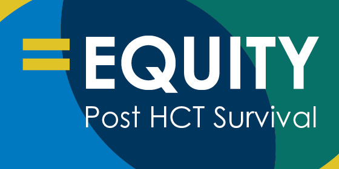

# Equity in Post-HCT Survival Predictions

## Introduction

We are Gal Elharar and Roy Wolfer, computer science students with a strong passion for data science and its applications in healthcare. For our semester project, we sought to tackle a meaningful challenge while expanding our skill set. After exploring Kaggle competitions, we were immediately drawn to the [Equity in post-HCT Survival Predictions](https://www.kaggle.com/competitions/equity-post-HCT-survival-predictions) challenge.

This competition focuses on predicting survival probabilities for patients undergoing hematopoietic cell transplantation (HCT), with an emphasis on ensuring equitable outcomes across different racial groups. The evaluation metric used in this challenge is the Stratified Concordance Index (C-index), which adjusts for racial stratification to promote fairness and equity in the predictions. This makes the challenge particularly impactful in addressing disparities in healthcare outcomes.

We are excited to dive into this project, combining our data science skills with our interest in advancing equity in medicine.

## The Problem

Improving survival predictions for allogeneic HCT patients is a vital healthcare challenge. Current predictive models often fall short in addressing disparities related to socioeconomic status, race, and geography. Addressing these gaps is crucial for enhancing patient care, optimizing resource utilization, and rebuilding trust in the healthcare system.

This competition aims to encourage participants to advance predictive modeling by ensuring that survival predictions are both precise and fair for patients across diverse groups. By using synthetic data, which mirrors real-world situations while protecting patient privacy, participants can build and improve models that more effectively consider diverse backgrounds and conditions.

You’re challenged to develop advanced predictive models for allogeneic HCT that enhance both accuracy and fairness in survival predictions. The goal is to address disparities by bridging diverse data sources, refining algorithms, and reducing biases to ensure equitable outcomes for patients across diverse race groups. Your work will help create a more just and effective healthcare environment, ensuring every patient receives the care they deserve.

## Methodology

### Data Exploration and Preprocessing

- **Reading the Data**: We started by reading the training and test datasets, observing the features and their distributions.
- **Handling Missing Values**: We chose to treat missing values as a separate category for categorical features.
- **Feature Correlation**: We explored the relationships between numerical features to identify redundant features.

### Survival Analysis Models

We experimented with various survival analysis models, including:

- **Cox Proportional Hazards Model**: Implemented using both XGBoost and CatBoost.
- **Accelerated Failure Time Model**: Implemented using both XGBoost and CatBoost.
- **Target Transformation Models**: Applied different target transformations to use regression algorithms with MSE loss.

### Evaluation

The competition's objective is to ensure equitable predictions across diverse patient populations. We evaluated our models using the Stratified Concordance Index (C-index) and compared the performance across different race groups.

## Results

### Best Performing Models

- **Cox Proportional Hazards Model (XGBoost)**: Achieved the highest overall score.
- **Target Transformation Models**: The `transform_quantile` transformation performed the best among the target transformations.

### Feature Importance

The most important features included `conditioning_intensity`, `dri_score`, and `comorbidity_score`, reflecting the physical state of the patient before HCT.

### Race Group Inequality

We observed that predictions for Asian patients generally had the highest scores, while predictions for white patients had the lowest scores. This highlights the need for strategies to ensure equitable predictions across all race groups.

## Conclusion

Our project demonstrates the potential of advanced predictive models to enhance both accuracy and fairness in survival predictions for HCT patients. By addressing disparities and ensuring equitable outcomes, we contribute to creating a more just and effective healthcare environment.

## Working Environment

We initially tried Google Colab and Deepnote but found them challenging for real-time collaboration and intellisense. We ultimately worked locally in VSCode using a virtual environment and the Live Share extension, which provided a more efficient and collaborative working environment.

## Acknowledgements

We would like to thank Kaggle for providing the platform and data for this competition. We also appreciate the support and guidance from our professors and peers throughout this project.

## References

- [Equity in post-HCT Survival Predictions](https://www.kaggle.com/competitions/equity-post-HCT-survival-predictions)
- [Kaplan–Meier Estimator](https://en.wikipedia.org/wiki/Kaplan%E2%80%93Meier_estimator)
- [Nelson–Aalen Estimator](https://en.wikipedia.org/wiki/Nelson%E2%80%93Aalen_estimator)
- [Cox Proportional Hazards Model](https://en.wikipedia.org/wiki/Proportional_hazards_model)
- [Accelerated Failure Time Model](https://en.wikipedia.org/wiki/Accelerated_failure_time_model)

